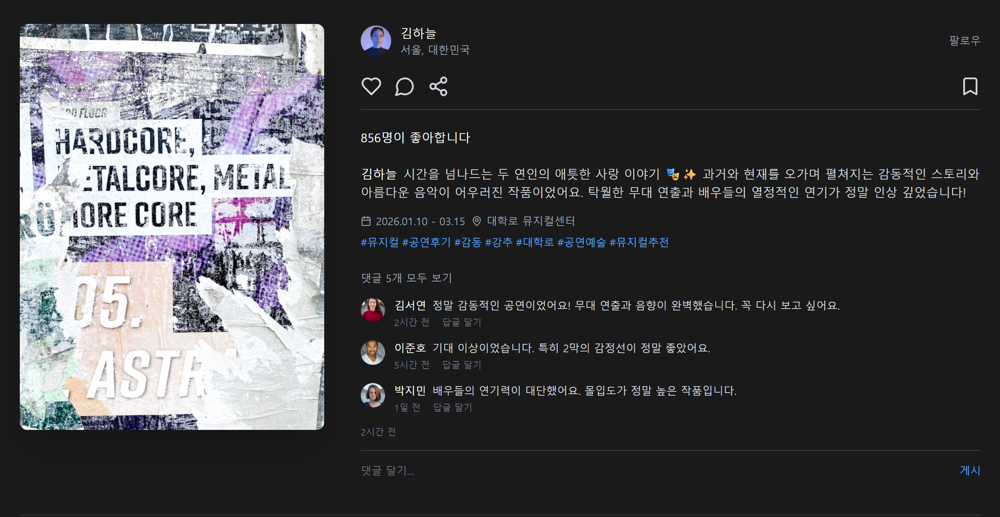
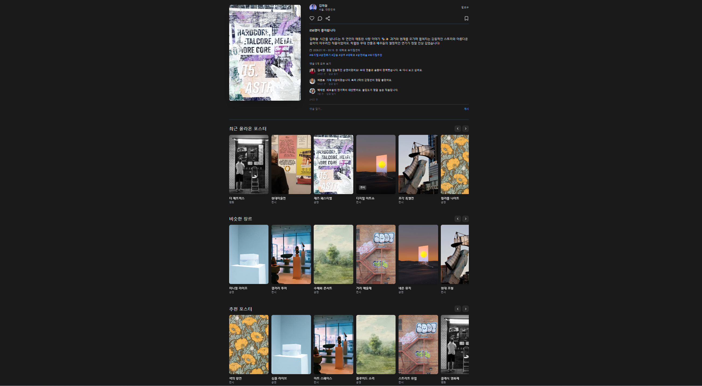

# `20260114` 프론트엔드 진행사항 정리

## 1. 작업 개요
프론트엔드 회의를 통해 페이지 단위로 역할을 분담하였으며,  
그중 **상세 페이지를 React 기반으로 먼저 구현하는 방향**으로 작업을 진행하였습니다.

본 작업은 실제 화면 구현과 더불어,  
이후 **발표 자료에서 목업 형태로 활용**하는 것을 함께 고려하여 진행하였습니다.

---

## 2. 상세 페이지 구현 (React)
- React 환경에서 **상세 페이지를 우선적으로 구현**하며, 페이지 구조와 컴포넌트 흐름을 점검하였습니다.
- 구현에 앞서 화면 구성에 대한 이해를 높이기 위해,  
  **LLM을 활용해 상세 페이지 시안을 이미지 형태로 구체화**하였고, 이를 기준으로 작업을 진행하였습니다.
- 상세 정보 영역과 추천 알고리즘 영역을 중심으로 화면 배치를 구성하였습니다.

---

## 3. 추천 알고리즘 영역 레이아웃 논의 및 적용
- 추천 알고리즘 결과 영역의 배치 방식에 대해 **가로 배치와 세로 배치**를 두고 팀 내 논의를 진행하였습니다.
- 상세 페이지의 정보 흐름과 사용자 스크롤 동선을 고려한 결과,  
  **세로 배치가 더 적합하다는 결론**에 도달하였습니다.
- 해당 논의 결과를 반영하여, **현재 React 구현은 세로 배치 구조로 작성**하였습니다.

### 상세 페이지 시안
  


---

## 4. Figma 학습 및 목업 구성
- Figma의 기본 개념을 학습하며, 프레임 구성과 화면 배치 방식을 이해하였습니다.
- 이를 바탕으로 상세 페이지의 **목업을 직접 구성**해보며,  
  개발 단계에서 화면 구현과 디자인 간의 간극을 줄이기 위한 사전 작업을 진행하였습니다.

---

## 5. 파일 구조
현재 작업한 파일 구조는 아래와 같습니다.

```text
.
├─ package.json
├─ package-lock.json
├─ vite.config.ts
├─ postcss.config.js
├─ index.html
├─ README.md
├─ ATTRIBUTIONS.md
├─ guidelines/
└─ src/
   ├─ assets/
   ├─ components/
   ├─ pages/
   ├─ App.jsx
   └─ main.jsx
