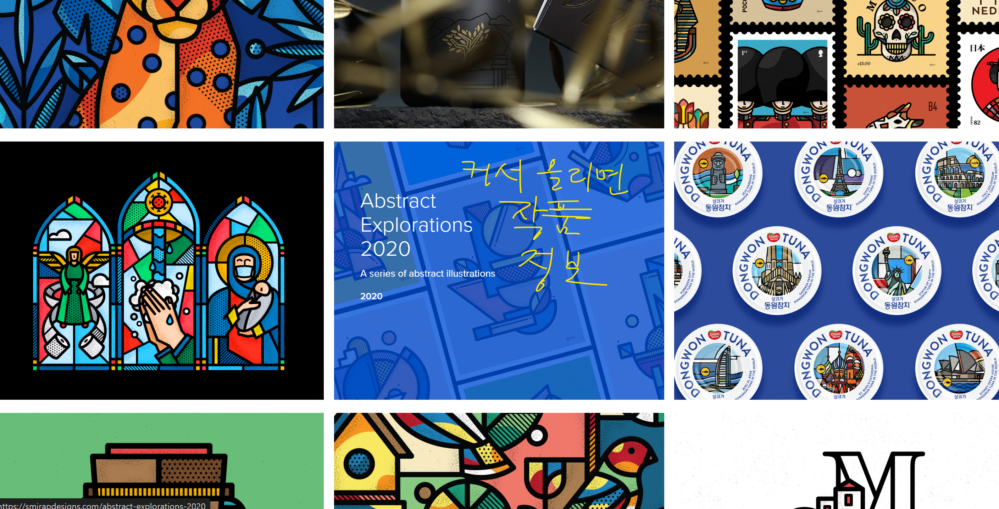

# 레퍼런스

## 피드 레퍼런스

- 가장 보편적인 피드 디자인
1. 커서 올리면 오버레이로 반투명 정보가 뜨는 경우
    
    
    
2. 커서 올리면 색이 변하면서 스포트라이트 되는 경우
    
    https://nickguttridgearchive.com/
    
    
    

- 피드 나열 방식
    - https://plan-az.com/project.php
        - 나열하되, 인터렉티브 방식으로 격자 안에서 벗어난 형태 (커서 갖다대면 호버)
            
            
            
    
- 무드보드
    - https://cargo.site/templates/preview/2834490
        
        
        
        
        
    
    ### 배열 및 웹 디자인 참고자료
    
    https://spencergabor.work/
    
    
    

누르면 팝업으로 작품 보게 구성되어 있음

- 크기별로 배치한 후 커서 갖다 대면 호버 효과

https://bradleyziffer.com/

- 스크롤로 콘텐츠 옆으로 넘어가고, 커서 갖다대면 말풍선으로 ‘알아보시려면 클릭하세요’ 같은 안내가 뜸
    - 책 형태로 제작되어 커서 갖다대면 책이 떠오름. 단순 호버 효과보다는 둥둥 뜨는 느낌

- 보드에다 붙여둔 콘텐츠 보는 느낌의 레퍼

https://danielsun.space/

- 책 쌓인 데에서 콘텐츠 뽑아오기

https://2manybooks.com/library/lisa/

## 갤러리 느낌

https://80years.hanjin.com/

- 홈페이지 안에 홈페이지가 있게

https://legodt.kr/

---

# 영상 포폴 레퍼

https://connectwave.co.kr/