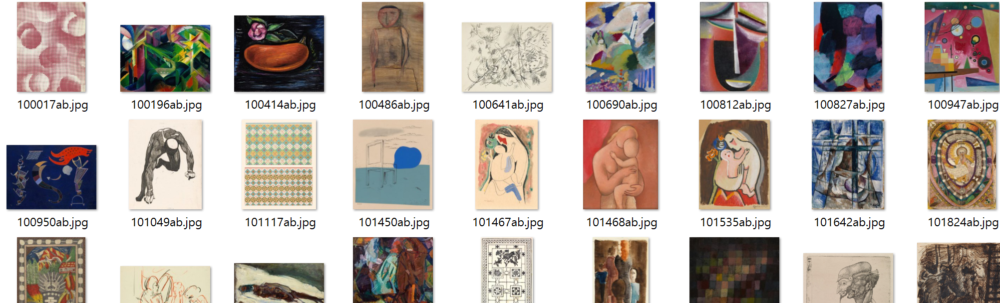

# 데이터 크롤링

날짜: 2026년 1월 15일
다중 선택: data

사이트 : [https://artvee.com/](https://artvee.com/) 

→ 저작권 만료된 해외 작품 

```jsx
import os
import re
import json
import requests
from bs4 import BeautifulSoup

# =============================
# 설정
# =============================
GENRES = [
		"abstract",
		"figurative",
		"landscape",
		"posters",
    "illustration",
    "religion",
    "mythology",
    "drawings",
    "still-life",
    "plants-animals"
]

BASE_TEMPLATE = "https://artvee.com/c/{genre}/page/{page}/?per_page={per_page}"
HEADERS = {
    "User-Agent": "Mozilla/5.0"
}

# =============================
# 공통 유틸
# =============================
def get_soup(url):
    res = requests.get(url, headers=HEADERS, timeout=10)
    res.raise_for_status()
    return BeautifulSoup(res.text, "html.parser")

# =============================
# 장르 설명 크롤링 (1회)
# =============================
def get_genre_description(genre):
    url = f"https://artvee.com/c/{genre}/"
    soup = get_soup(url)

    desc_tag = soup.select_one("div.container p")
    return desc_tag.get_text(strip=True) if desc_tag else ""

# =============================
# 작품 파싱
# =============================
def parse_artwork(item, save_dir, description):
    # 작품명 + 연도
    title_tag = item.select_one("h3.product-title a")
    full_title = title_tag.get_text(strip=True) if title_tag else ""

    year_match = re.search(r"\((\d{3,4})\)", full_title)
    year = year_match.group(1) if year_match else ""
    title = full_title.replace(f"({year})", "").strip()

    # 작가
    artist_tag = item.select_one(".woodmart-product-brands-links a")
    artist = artist_tag.get_text(strip=True) if artist_tag else ""

    # 이미지
    img_tag = item.select_one("img")
    img_url = img_tag["src"] if img_tag else ""

    img_name = img_url.split("/")[-1].split("?")[0] if img_url else ""
    img_path = os.path.join(save_dir, img_name)

    # 이미지 다운로드
    if img_url and not os.path.exists(img_path):
        try:
            with requests.get(img_url, stream=True, timeout=10) as r:
                if r.status_code == 200:
                    with open(img_path, "wb") as f:
                        for chunk in r.iter_content(1024):
                            f.write(chunk)
        except Exception as e:
            print(f"이미지 다운로드 실패: {img_url} ({e})")

    return {
        "title": title,
        "year": year,
        "artist": artist,
        "genre": save_dir,
        "image_path": img_path,
        "description": description
    }

# =============================
# 페이지 크롤링
# =============================
def crawl_pages(genre, start_page, end_page, per_page=70):
    save_dir = genre
    os.makedirs(save_dir, exist_ok=True)

    # 장르 설명은 1번만
    genre_description = get_genre_description(genre)

    all_artworks = []

    for page in range(start_page, end_page + 1):
        url = BASE_TEMPLATE.format(
            genre=genre,
            page=page,
            per_page=per_page
        )

        soup = get_soup(url)
        items = soup.select("div.product-grid-item")

        if not items:
            print(f"[{genre}] page {page}: 항목 없음")
            break

        for item in items:
            artwork = parse_artwork(
                item=item,
                save_dir=save_dir,
                description=genre_description
            )
            all_artworks.append(artwork)

        print(f"[{genre}] page {page} 완료 ({len(items)}개)")

    return all_artworks

# =============================
# 실행부
# =============================
if __name__ == "__main__":
    START_PAGE = 1
    END_PAGE = 3
    PER_PAGE = 70

    for genre in GENRES:
        print(f"\n===== {genre} 크롤링 시작 =====")

        result = crawl_pages(
            genre=genre,
            start_page=START_PAGE,
            end_page=END_PAGE,
            per_page=PER_PAGE
        )

        json_path = f"{genre}_artworks.json"
        with open(json_path, "w", encoding="utf-8") as f:
            json.dump(result, f, ensure_ascii=False, indent=2)

        print(f"[{genre}] 총 수집: {len(result)}")

```

### 결과

- 이미지 : 각 장르명 폴더에 저장



- 데이터 : 각 장르명_artworks.json으로 저장

```jsx
json 형식
[
  {
    "title": "Playing with a Ball",
    "year": "1930",
    "artist": "Mikuláš Galanda",
    "genre": "abstract",
    "image_path": "abstract\\912637ab.jpg",
    "description": "Art that does not attempt to represent an accurate depiction of a visual reality but instead use shapes, colours, forms and gestural marks to achieve its effect."
  },
  {
    "title": "Rote Erde (Red Earth)",
    "year": "1926",
    "artist": "Paul Klee",
    "genre": "abstract",
    "image_path": "abstract\\102908ab.jpg",
    "description": "Art that does not attempt to represent an accurate depiction of a visual reality but instead use shapes, colours, forms and gestural marks to achieve its effect."
  },
  ...
]
```

**장르 목록**

- abstract 추상화 (210개)
- figurative 구상화 (210개)
- landscape 풍경화 (210개)
- posters 포스터 (210개)
- illustration 일러스트레이션 (210개)
- religion 종교화 (210개)
- mythology 신화 (210개)
- drawings 드로잉 (210개)
- still-life 정물화 (209개)
- plants-animals 식물/동물 (210개)