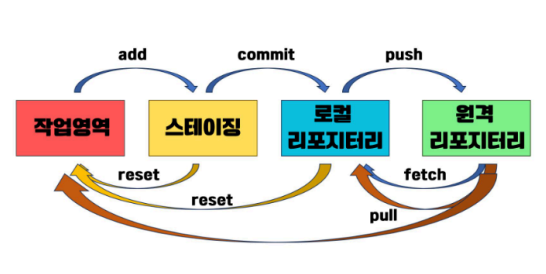

# GIT

# GIT?

- **분산형 버전 관리 시스템**

## 주요 기능

- **버전관리** : 코드 변경 사항을 추적하고 기록
- **분산 시스템** : 로컬에서도 저장소를 관리 할 수 있음
- **브랜치** : 독립적인 작업 공간을 만들어 코드 변경 가능
- **머지(Merge)** : 여러 브랜치를 합쳐 변경 사항을 반영

## GitHub?

- Git 저장소를 온라인에서 관리할 수 있는 **클라우드 기반 플랫폼**

### 주요 기능

- **원격 저장소** : 코드 저장 및 공유
- **협업 도구** : Pull Request(PR), 코드 리뷰, lssues 등을 통해 팀원과 협업 가능
- **CI/CD 지원** : GitHub Actions 등을 활용해 자동화 구축 가능

## Git의 기본 용어와 개념



### 영역

- **Working directory (작업 영역)**
    - 실제 소스코드 작업이 이루어지는 로컬 PC의 디렉토리 파일과 파일
- **Staging area(스테이징 영역) - “ADD”**
    - 작업 영역에서 작업한 내용 중 git이 관리하는 로컬 저장소로 저장하기 위해 저장할 대상
    을 선정하는 임시 영역
    - 저장할 대상이 되는 파일을 선택하는 무대영역이라는 의미
- **Repository (저장소) - “COMMIT”**
    - Git 프로젝트를 관리하는 공간
    - 로컬 저장소(Local)와 원격 저장소(Remote)로 구분
    
    - **Local (로컬 저장소)**
        - 개인 PC에서 관리하는 Git 저장소로, 원격 저장소와 동기화하여 사용
        - Git의 버전관리가 이루어지는 실제 Git 저장소를 의미
        - Git은 이 로컬 저장소 대비 작업 영역의 변경사항을 체크
        
    - **Remote (원격 저장소) - “PUSH”**
        - 원격 서버(GitHub)에서 관리되는 저장소로, 협업을 위해 사용
        - 다른 개발자와 코드를 공유하기 위해 로컬 저장소와 동기화되는 원격 저장소이며 깃 허
        브 등의 서비스를 의미
        - Git은 원격저장소 대비 로컬 저장소의 변경사항을 체크

---

### 브랜치와 마스터

- **Master (마스터)**
    - 각 저장소의 기본이 되는 코드
    - 함부로 수정 불가
    - 기본 브랜치 `main`
    
- Branch (브랜치)
    - 독립적인 작업을 위한 개별적인 코드 흐름
    - 새로운 기능을 개발할 때 새 브랜치 만들어서 작업해야함
    

## 시작하기

1. 사용자 설정

```bash
git config --global user.name "이름"
git config --global user.email "이메일"

//확인
git config user.name
git config user.email
```

1. 클론 생성

```bash
git clone 주소
```

1. 스테이징 올리기 (ADD)

```bash
add .
add /파일

//확인
git status
```

1. 로컬 저장소 올리기 (COMMIT)

```bash
git commit -m "컨벤션"

//확인
git log
```

1. 원격저장소 (PUSH)

```bash
git push origin [브랜치명]
```

1. 원격저장소에서 내려받기 (PULL)

```bash
git pull
git pull origin main
```

log 보는 법(커밋 히스토리 확인)

```bash
//기본 로그 확인
git log

//한줄로 요약
git log --oneline

//그래프 형태로 브랜치 포함해서 보기
git log --oneline --graph -- all
```

---

### git의 모든 변경사항을 초기화하고 로컬과 원격 동기화하는 방법(3가지)

1. 새로 클론하기
    
    ```bash
    git clone 주소
    ```
    
2. 기존 폴더 유지 : 원격 저장소 상태로 `--hard reset` & GC
    
    폴더 전체를 없애고 싶지 않거나 추가적으로 작업한 파일을 남겨두고 싶다면
    
    **로컬 변경사항 폐기 후 원격으로 리셋**
    
    ```bash
    #1) 원격에서 최신 상태 받아오기
    
    git fetch --all
    
    #2) 로컬 main(또는 리셋하고자 하는 브랜치)으로 체크아웃
    git checkout main
    
    #3) 원격 main과 동일하게 강제 재설정
    git reset --hard origin/main
    ```
    
    **로컬 main이 원격 origin/main의 스냅샷과 동일**해지고, 그동안 로컬에만 존재하던 커밋들이 ‘분기’상태가 됨(표면상 사라짐)
    
3. Reflog & Git GC 정리
    
    Git은 내부적으로 reflog라는 곳에 지워진(또는 분기된) 커밋들의 기록을 일정 기간 보관. 완전히 초기화 하려면 reflog를 만료시키고 GC수행 해야함
    
    ```bash
    # reflog에서 더 이상 참조되지 않는 모든 커밋을 만료 처리
    git reflog expire --expire=now --all
    # 불필요한 이력 및 객체를 실제로 정리 (GC)
    git gc --prune=now --aggressive
    ```
    
    이 과정을 거치면, 로컬에서만 존재했던 이전 커밋 이력은 사실상 제거되고, `git log` 를 봐도
    원격에 존재하는 커밋들만 남게 됩니다.
    
    <aside>
    
    💡 위 과정은 한 번 진행하면 로컬에서만 있던 커밋 복구가 사실상 불가능하니, 정말 다 삭제해도 되는지 확인
    
    </aside>
    

---

### Revert / Reset / Restore

1. 커밋 되돌리기(되돌렸다는 커밋 로그 남기기)
    
    ```bash
    git revert HEAD
    :wq(탈출)
    git log
    ```
    

1. 리셋으로 커밋 삭제하기
    1. mixed : 커밋은 지우지만 워킹디렉토리에는 남기기
    2. hard : 커밋, 워킹디렉토리 다 지움
    
    ```bash
    git reset -- mixed HEAD~1
    git reset --hard HEAD~1
    ```
    

1. Restore 로 작업 되돌리기 : add 되돌리기 
    
    ```bash
    git restore --staged 파일명
    
    //워킹디렉토리도 되돌리기 --staged해주고  restore 한번 더
    git restore 파일명 -> 마지막 커밋 상태로 되돌아감
    ```
    

| 명령어 | 역할 | 특징 |
| --- | --- | --- |
| git revert | 특정 커밋을 취소하는 새로운 커밋 생성 | 협업에 안전, 히스토리를 보존하며 취소 |
| git reset | 특정 커밋 이후 히스토리를 완전히 삭제 | 스테이징/워킹 디렉토리까지 삭제 가능, 신중 |
| git restore | 워킹 디렉토리나 스테이징 영역에서 변경을 되돌림 | Git 2.23 이후 추가, checkout 대체 |

---

### 브랜치와 협업

**새로운 기능을 위한 브랜치 생성 및 이동**

```bash
git branch 브랜치명
git branch //확인
git checkout 브랜치명
```

**어떤 브런치를 사용할지 선택하는 기준(프리픽스)**

- 새로운 기능 개발? → feature/*
- 버그 수정? → bugfix/* (개발 브랜치) 또는 hotfix/* (운영 브랜치)
- 배포 준비? → release/*
- 긴급 수정? → hotfix/*
- 리팩토링, 문서 작업? → chore/* , docs/*
- 실험적 테스트? → experiment/*

**기능 개발 및 변경사항 저장**

git push → 깃허브 pull request → 코드리뷰 → 최종 merge

1. 원격 저장소와 로컬 저장소 동기화

```bash
git checkout main
git pull -> 안하고 브랜치 삭제하면 error: the branch 'feature-edit' is not fully merged
```

1. 기존 브랜치 제거

```bash
git brach -d 브랜치명 -> 안지워지면 -D
```

<aside>
💡

충돌!!

1.  메인을 동기화 (브랜치만다름)
2. 브랜치로 들어감 → 메인을 브랜치에 merge해줌
3. 충돌 수정 → push 브랜치
</aside>

## 메시지 컨벤션

### Commit 메세지 구조

<aside>

type : 제목

body(본문, 생략가능)

Resolve: “ #issue, … (해결한 이슈,생략 가능)”

See also : “#issue, (참고해야할 이슈, 생략 가능)”

</aside>

### Git Commit 메시지 규칙 정리

1.  **커밋 타입 지정 (태그 활용)**
커밋 메시지의 첫 단어는 변경 사항의 유형을 나타낸다.
    
    
    |  | 설명 |
    | --- | --- |
    | FEAT  | 새로운 기능 추가 |
    | FIX  | 버그 수정 |
    | DOCS  | 문서 수정 및 추가 |
    | STYLE  | 코드 스타일 변경 (포매팅, 세미콜론 누락 등) |
    | REFACTOR  | 코드 리팩토링 (기능 변경 없이 개선) |
    | TEST  | 테스트 코드 추가 및 리팩토링 테스트 |
    | CHORE  | 빌드 설정 변경, 패키지 매니저 수정 ( .gitignore 수정 등) |
2. 제목과 본문은 빈 줄로 분리
커밋 제목과 본문을 작성할 때, 제목과 본문 사이에 빈 줄을 넣어 가독성을 높입니다.
    
    <aside>
    
    FIX: 로그인 시 비밀번호 검증 오류 수정
    
    로그인 시 비밀번호가 공백이 입력될 경우 발생하는 문제를 수정했습니다.
    
    </aside>
    
3.  제목 행은 50자 이내로 제한
    - 커밋 메시지의 제목은 50자를 넘지 않도록 작성
    - 너무 긴 메시지는 가독성을 떨어뜨리며, 여러 개의 커밋을 확인할 때 불편함을 초래
    
4. 제목 행의 첫 글자는 대문자로 시작
    - 커밋 메시지의 제목은 항상 대문자로 시작

1. 제목 행 끝에 마침표(.) 사용 금지
2. 제목은 명령형으로 작성
3. 본문에는 변경 내용과 이유를 작성

etc..

rebase merge?

→ 컨벤션 차이(rebase 로그가 한줄로 깔끔하게 나ㅏ옴~~)